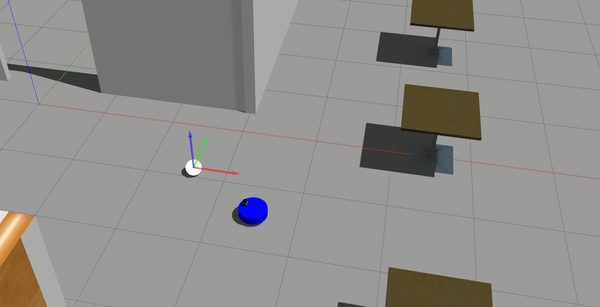

# ROSND Go Chase It

## Dependencies for Running Locally
* ROS (tested in melodic)

## Basic Build Instructions

1. Clone this repo to e.g. C:/home/workspace/workspace.
2. cd /home/workspace/Udacity-ROSND-Project-GoChasIt/
3. catkin_make

## Launch the Robot
1. cd /home/workspace/Udacity-ROSND-Project-GoChasIt/
2. source devel/setup.bash
3. roslaunch my_robot world.launch

## Run drive_bot and process_image
1. cd /home/workspace/Udacity-ROSND-Project-GoChasIt/
2. source devel/setup.bash
3. roslaunch ball_chaser ball_chaser.launch

## Camera Visualization
1. cd /home/workspace/Udacity-ROSND-Project-GoChasIt/
2. source devel/setup.bash
3. rosrun rqt_image_view rqt_image_view  
